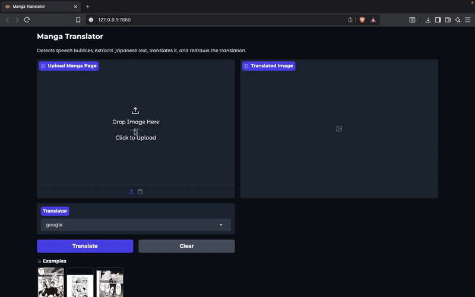

# Manga Panel Translator

[](LICENSE)


A tool for translating manga panels from Japanese to English using computer vision and machine learning, while preserving the original artwork.


## Overview

This project automates the translation of manga panels by detecting text regions, extracting Japanese text, translating it to English, and replacing it in the original panels. It leverages object detection with YOLO for text localization, optical character recognition (OCR), machine translation, and image inpainting for seamless integration.

The application is built with a user-friendly interface powered by Gradio, making it easy to upload manga pages and receive translated outputs.

 <!-- Placeholder: Replace with a screenshot of the Gradio interface -->

## Before & After Translation

See the transformation in action! Here's how the tool converts Japanese manga panels to English:

<div style="display: flex; justify-content: space-around; align-items: center;">
  <div>
    <h3>Original Japanese Panel</h3>
    
  </div>
  <div>
    <h3>Translated English Panel</h3>
    
  </div>
</div>

_The tool preserves the original artwork while seamlessly replacing Japanese text with accurate English translations._

## Features

- **Text Detection**: Uses YOLO to accurately identify text bubbles and regions in manga panels.
- **OCR and Translation**: Extracts Japanese text and translates it to English using robust libraries.
- **Image Editing**: Replaces original text with translated English text while preserving the artistic style.
- **Web Interface**: Intuitive Gradio-based UI for easy uploading and downloading of translated manga.

## Installation

To set up the project locally, follow these steps:

1. Clone the repository:

```bash
git clone https://github.com/CodeNinjaSarthak/manga-panel-translator.git
cd manga-panel-translator
```

2. Create a virtual environment (recommended):

```bash
python -m venv venv
source venv/bin/activate # On Windows: venv\Scripts\activate
```

3. Install dependencies:

```bash
pip install -r requirements.txt
```

4. Launch the Gradio interface:

```bash
python app.py
```

Open your browser and navigate to the provided local URL (usually `http://127.0.0.1:7860`).

Upload a manga page image.

Click "Translate" to process and download the English version.

## Technologies Used

- **YOLO**: For object detection and text region identification.
- **Gradio**: For building the interactive web interface.
- **Other Libraries**: Includes Tesseract OCR, Google Translate API (or similar), OpenCV for image processing, and Pillow for image manipulation.

| Library      | Purpose                         |
| ------------ | ------------------------------- |
| YOLO         | Text detection in panels        |
| Gradio       | User interface                  |
| Tesseract    | Optical character recognition   |
| OpenCV       | Image processing and inpainting |
| Transformers | Machine translation (optional)  |

## Team

This project is developed and maintained by:

- **Sarthak Chauhan**
- **Siddharth Patel**

## Together, we collaborate to improve and expand this manga panel translator tool.

## Contributing

Contributions are welcome! Please follow these steps:

1. Fork the repository.
2. Create a new branch: `git checkout -b feature/your-feature`.
3. Commit your changes: `git commit -m 'Add your feature'`.
4. Push to the branch: `git push origin feature/your-feature`.
5. Open a pull request.

For bug reports or feature requests, open an issue on GitHub.

## License

This project is licensed under the MIT License. See the [LICENSE](LICENSE) file for details.

---

_Built with ❤️ by [Sarthak Chauhan](https://github.com/CodeNinjaSarthak). If you find this project useful, give it a ⭐ on GitHub!_
